# 基于Springboot的知识管理系统

## Springboot-0063


## 技术栈

Springboot mybatisplus vue mysql maven


## 数据库表(15张)


## 功能介绍

```properties
管理员功能有个人中心，用户管理，文章分类管理，文章信息管理，资料分类管理，资料下载管理，问答管理，论坛交流，留言板管理，系统管理等。

用户功能有个人中心，文章信息管理，资料下载管理，问答管理，我的收藏管理。
```


## 图片

### 前台


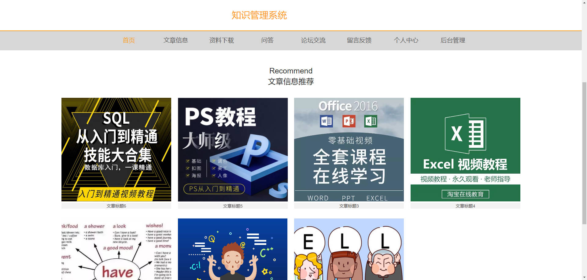

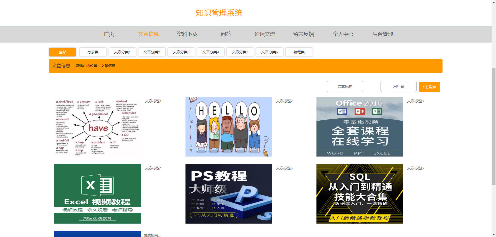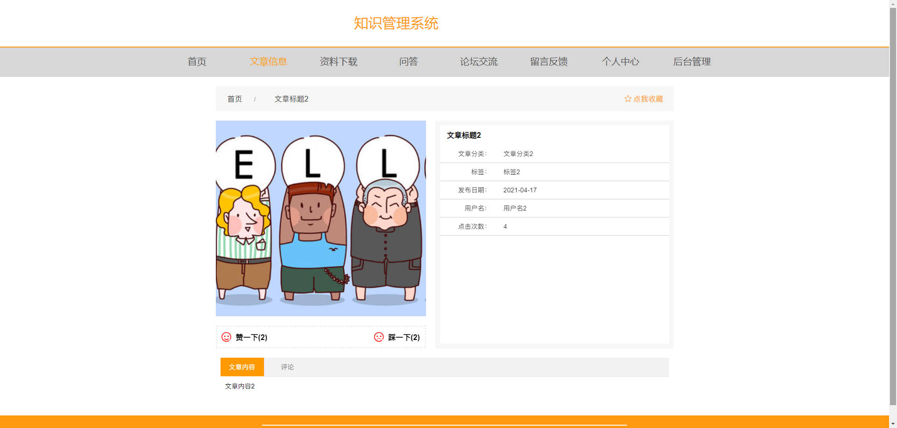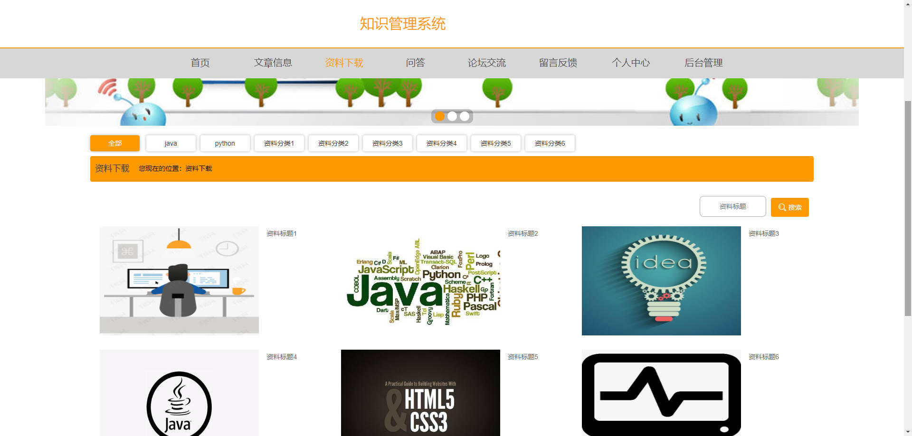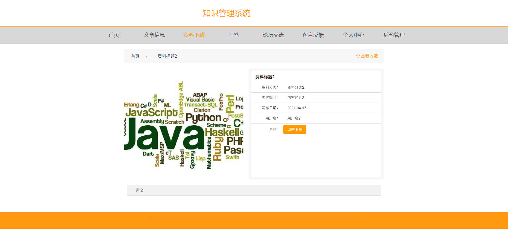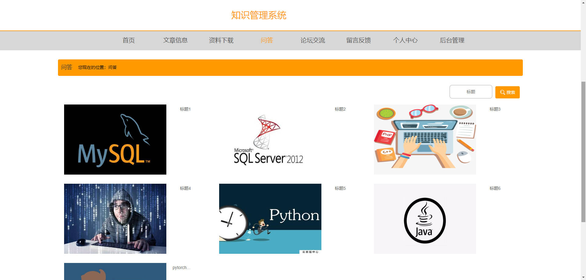

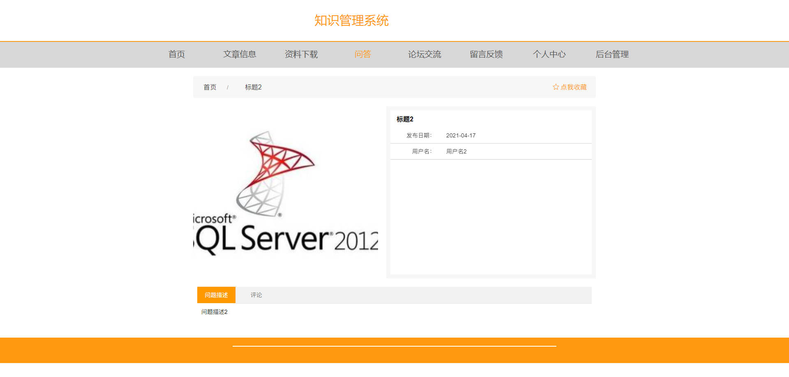

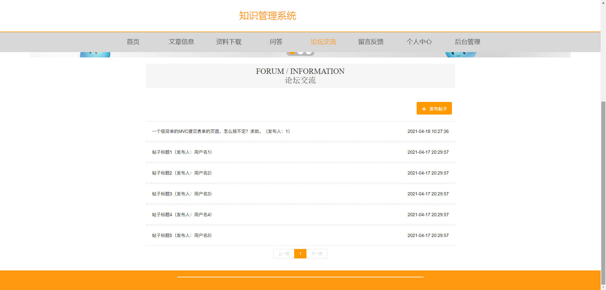

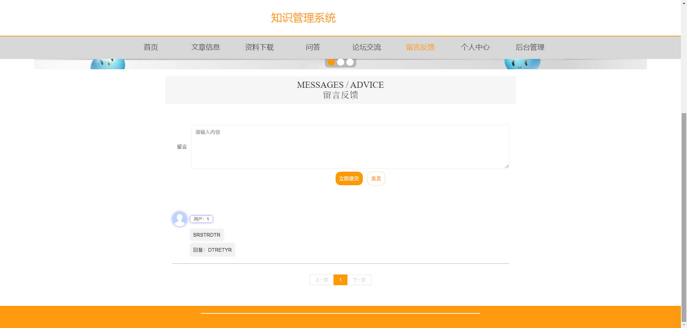

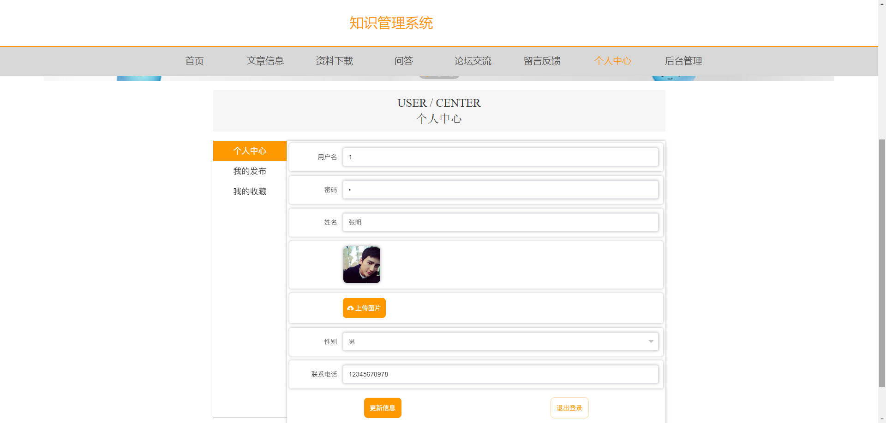

### 后台

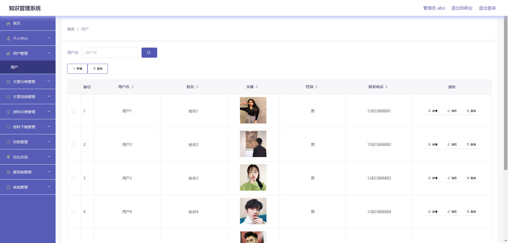

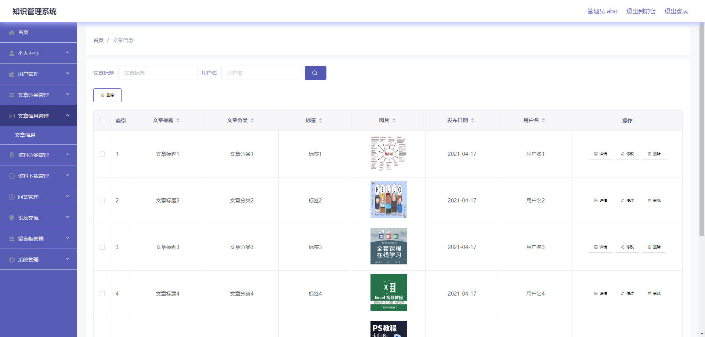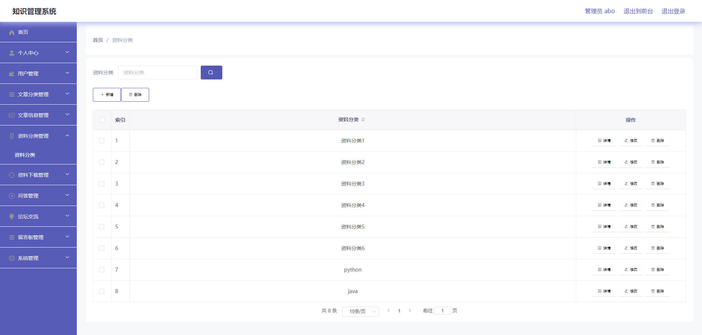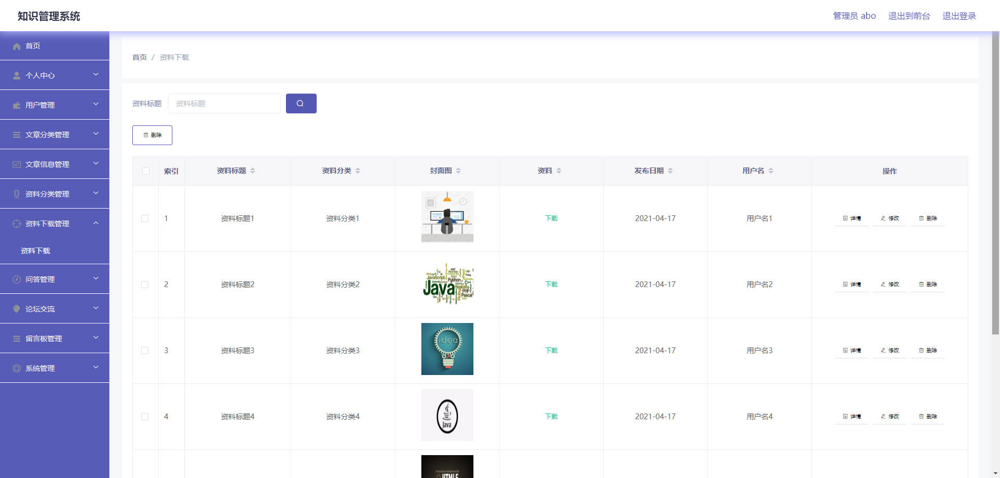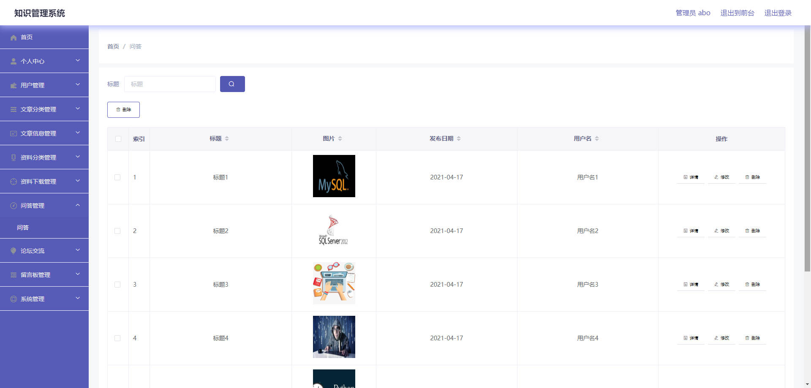

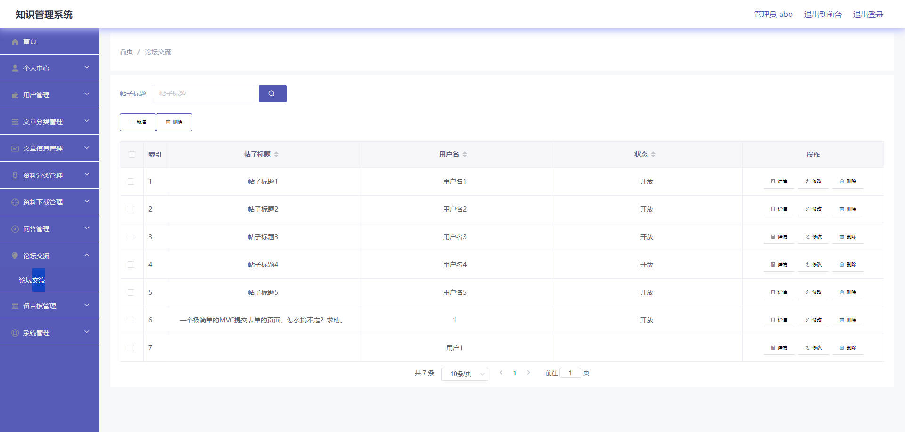

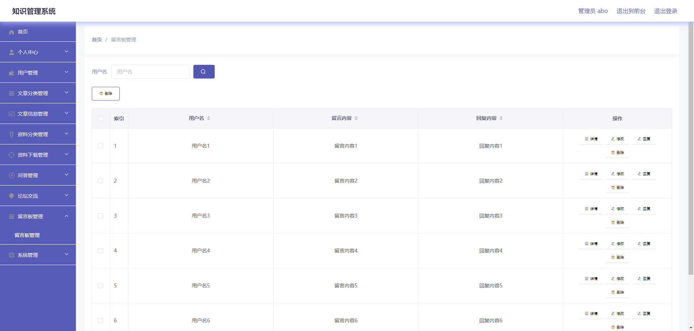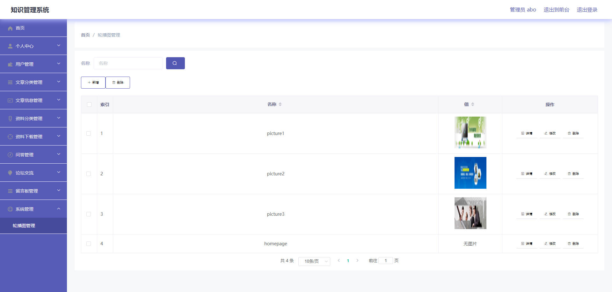

## 访问路径

### 前台

```properties
http://localhost:8080/springboot0w575/front/pages/login/login.html

账号 1
密码 1
```

### 后台

```properties
http://localhost:8080/springboot0w575/admin/dist/index.html#/login

账号 abo
密码 abo
```


## 功能图

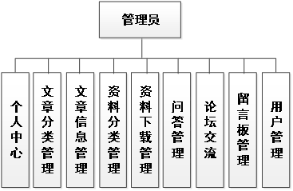

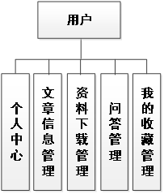

## 文档目录

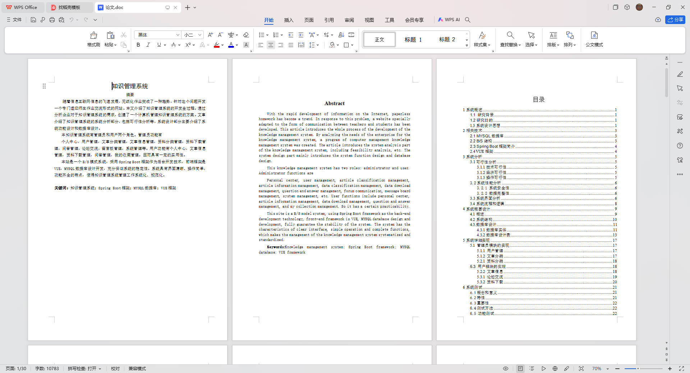


## 打赏或交流


